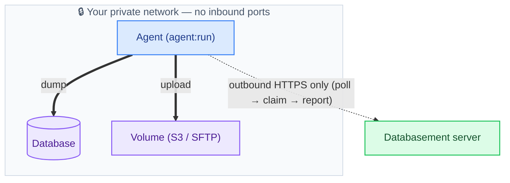

# Remote Agents

A remote **agent** backs up databases that Databasement cannot reach directly — without opening any inbound port to them.

Instead of Databasement connecting **in** to your database (as an [SSH tunnel](./ssh-tunnel.md) does), you run a small agent next to the database that connects **out** to Databasement. The database stays completely private; only outbound HTTPS is ever needed.

:::info Egress, not ingress
The SSH tunnel needs **inbound** access (Databasement reaches into the network). An agent needs only **outbound** HTTPS. That makes it the right fit for hardened, firewalled, or multi-tenant environments where opening inbound ports is forbidden.
:::

## How it works

The agent is the same Databasement image running in agent mode (`agent:run`). It polls the server over HTTPS, claims any job assigned to it, runs the dump on its own network, uploads the result straight to your storage volume, and reports back. It never receives an inbound connection and never touches the server's database.



1. **Poll** — the agent sends a heartbeat and asks the server for work.
2. **Claim** — the server hands back a job describing the database, the schedule, and the destination volume.
3. **Run** — the agent dumps the database (it reaches it on the local network) and uploads the snapshot to the volume.
4. **Report** — the agent acknowledges the result (filename, size, checksum, logs) so the snapshot shows up in the UI like any other.

## When to use an agent

- The database lives in a network where **no inbound port** can be opened (compliance, firewall, customer-managed VPC).
- You back up databases in **many isolated networks** and want one Databasement server orchestrating them all over HTTPS.
- An [SSH tunnel](./ssh-tunnel.md) isn't possible because there's no SSH host to reach.

If you *can* reach the database directly or over SSH, prefer that — it's simpler. The agent's unique value is the outbound-only connectivity.

## Setup

1. **Create an agent** — go to **Agents → Add Agent**, then copy the token shown once on creation.
2. **Run the agent** next to your database, pointing it at your server:

   ```bash
   docker run -d --restart unless-stopped \
     --name databasement-agent \
     -e DATABASEMENT_URL='https://databasement.example.com' \
     -e DATABASEMENT_AGENT_TOKEN='<paste-token>' \
     davidcrty/databasement:1
   ```

   When `DATABASEMENT_URL` is set, the container runs in agent mode — it only executes `agent:run` and needs no database configuration of its own.

3. **Assign the agent** to a database server by setting its **Agent** field. From then on, that server's backups run through the agent.

The **Agents** page shows each agent's connection status, so you can confirm it's polling.

## Constraints

- **No local volume** — the agent uploads from its own network, so it must use a reachable destination (S3-compatible or SFTP/FTP), not the server's local storage.
- **Backups only** — restore is not available for agent-backed servers.
